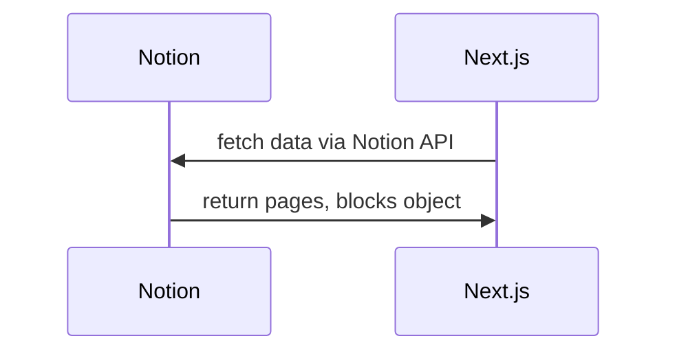

## notion-headless-cms-nextjs-blog

This repository is for displaying articles written in Notion in a blog application implemented in Next.js.


## Motivation for this Repository

I wanted to create my own blog and use Notion as an editor for writing articles, which is what I am used to doing.

## Ref
- This repo is based on [notion-next-blog-course](https://github.com/takux/notion-next-blog-course)
  - https://www.udemy.com/share/106MVk3@Dk6VAPO7ap6ww84XQYVzDpuFcvQpFnSmEk6P3zT9JRTzcpeoYZ2toaBhgRl3eW_f/
- Notion API Reference
  - https://developers.notion.com/reference/intro

## Architecture



## Tech Stack
- React v18.2.0
- Next.js v13.1.2
- TypeScript v4.9.4
- @notionhq/client(Notion API Client) v1.0.4
  - The latest version is v2, but due to destructive changes in the API interface, v1 is used.

## Getting Started

First, run the development server:

```bash
npm install
npm run dev
```

Second, run build:

```bash
npm run build
```

Finally, run start

```bash
npm run start
```

## Deploy

This app is using Vercel.
So, git push only.

URL: https://samuraikun-notion-blog.vercel.app/
